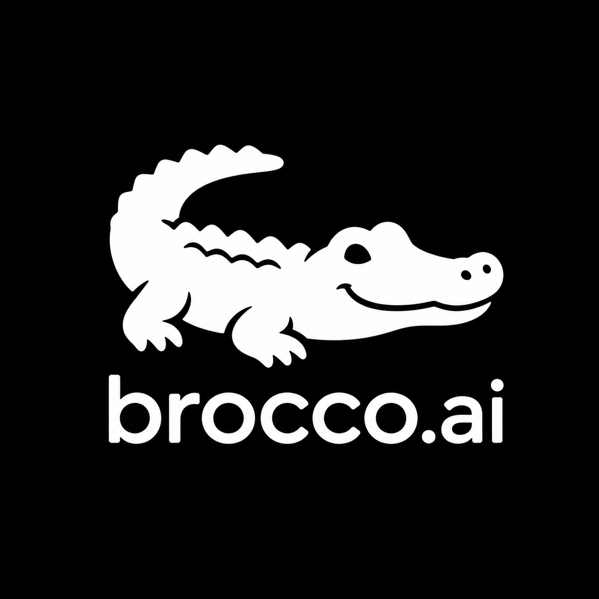

<p align="center">
  <a href="https://brocco.dev">
    
  </a>
</p>

<p align="center">
  <em>multi-agent broadcast dashboard. one goal, nine specialists, parallel streams.</em>
</p>

<p align="center">
  <a href="https://brocco.dev"></a>
  <a href="https://github.com/brocktherock52/brocco"></a>
  <a href="https://github.com/brocktherock52/brocco/blob/main/LICENSE"></a>
</p>

---

# Brocco

Multi-agent broadcast dashboard for AI agents. Type one goal, fan out to N agents in parallel, each with its own streaming pane and tools. **Bring your own Anthropic key — zero data retention.**

> Live: [brocco.dev](https://brocco.dev) · Source: [brocktherock52/brocco](https://github.com/brocktherock52/brocco)

## Try the live API

```bash
curl -X POST https://brocco.dev/api/v1/run \
  -H 'Content-Type: application/json' \
  -d '{"prompt":"What are the top 3 AI startups shipped this week?"}'
```

Streams Server-Sent Events. One free run per IP per 24 hours.

## Self-host locally

```bash
git clone https://github.com/brocktherock52/brocco
cd brocco
npm install
# Required: get a free key at https://console.anthropic.com
ANTHROPIC_API_KEY=sk-ant-... npm run dev
# → http://localhost:3000
```

## Deploy your own

[](https://vercel.com/new/clone?repository-url=https%3A%2F%2Fgithub.com%2Fbrocktherock52%2Fbrocco&env=ANTHROPIC_API_KEY&envDescription=Required%20to%20run%20live%20agents.%20Get%20one%20at%20console.anthropic.com.&envLink=https%3A%2F%2Fconsole.anthropic.com)

## What you get

- **9 built-in agents** with distinct personas (researcher, coder, browser, analyst, designer, planner, outreach, supervisor, app_builder) and declared tool permissions
- **11 pre-filled recipes** that pre-populate goal + agent set (market-research, customer-deep-dive, launch-day, comp-teardown, etc.) — time-to-first-value under 60 seconds
- **Real Claude streaming** via Server-Sent Events with retry+backoff, AbortSignal propagation, per-token cost ticker, and structured error events
- **BYOK by default** — tokens go from your browser straight to Anthropic, never through our server. Hosted mode available for users who don't want to manage keys.
- **Free demo mode** — try the dashboard without an API key (templated streaming)
- **PWA installable**

## Stack

- **Framework:** Next.js 15 (App Router, Edge runtime for `/api/*`)
- **UI:** Tailwind CSS, Radix Primitives, shadcn-style component patterns
- **Motion:** Framer Motion (Motion v12)
- **Billing:** Stripe (Checkout + Customer Portal + signed webhooks, no SDK)
- **Live demo backend:** Anthropic Claude + Tavily search

## API

POST `/api/v1/run`

```json
{
  "prompt": "string, 4-1000 chars"
}
```

Auth: none for the public demo (cookie-rate-limited to 1 run / 24h per browser).

Response: Server-Sent Events stream. Each event is a JSON object on a `data:` line.

| Event type | Fields | Emitted when |
|---|---|---|
| `run_started` | `request_id`, `agent`, `prompt` | Run begins |
| `step_start` | `step` | New step in the agent loop |
| `text_delta` | `step`, `text` | Per-token text streaming (NEW) |
| `assistant_turn` | `step`, `stop_reason`, `content[]`, `usage` | Step complete |
| `tool_call` | `step`, `tool`, `input`, `tool_use_id` | Agent invoked a tool |
| `tool_result` | `step`, `tool`, `output`, `is_error`, `tool_use_id` | Tool returned |
| `assistant_text` | `text` | Final synthesis |
| `run_finished` | `status: "done"\|"error"`, `code?`, `error?`, `request_id` | Run ended |

Errors return:
```json
{
  "error": "rate limit",
  "code": "rate_limit",
  "detail": "You've used your free demo run for today...",
  "doc_url": "https://brocco.dev/docs/errors#rate_limit",
  "request_id": "req_..."
}
```

HTTP status codes: 400 (validation/invalid_json), 401 (auth), 403 (ssrf_blocked), 429 (rate_limit), 502 (upstream_error), 503 (demo_offline/upstream_overloaded/tool_unavailable), 504 (timeout).

Full reference: [`docs/api.md`](docs/api.md).

GET `/api/v1/agents` — list of available agents and their tool permissions.

## Stability commitment

`/api/v1/*` is the only stable surface. Breaking changes get a `/api/v2/`.

## Layout

```
app/
  page.tsx            - landing
  app/                - interactive multi-agent dashboard
  pricing/            - pricing + tier comparison
  api/
    checkout/         - Stripe Checkout session
    portal/           - Stripe Customer Portal
    proxy/            - read-only HTTP proxy with SSRF protection
    stripe-webhook/   - signed Stripe webhook (Edge WebCrypto)
    v1/agents/        - list available agents
    v1/run/           - SSE-stream a live Claude tool-use loop
components/
  hero-bento, agents-bento, surfaces-filmstrip   - v4.6 bento UI
  dashboard/                                      - /app interface
lib/
  agents, agent-profiles, claude, errors, ssrf, simulator, tool-profiles
public/
  assets, manifest.webmanifest
```

## Documentation

- [`docs/api.md`](docs/api.md) — full API reference
- [`docs/self-host.md`](docs/self-host.md) — environment variables, Stripe setup, deployment
- [`docs/byok.md`](docs/byok.md) — BYOK flow, data handling, key revocation
- [`docs/examples/curl-quickstart.md`](docs/examples/curl-quickstart.md) — copy-paste curl recipes
- [`CHANGELOG.md`](CHANGELOG.md) — version history
- [`CONTRIBUTING.md`](CONTRIBUTING.md) — how to file issues and PRs
- [`DESIGN.md`](DESIGN.md) — visual design system

## Pricing (when you outgrow the free demo)

| Plan | Monthly | Annual |
|---|---|---|
| Solo | $49 | $490 |
| Team | $199 | $1,990 |

Try free with your own Anthropic key. Upgrade when you want scheduled runs, saved outputs, or team workspaces.

## License

MIT. See [`LICENSE`](LICENSE).
